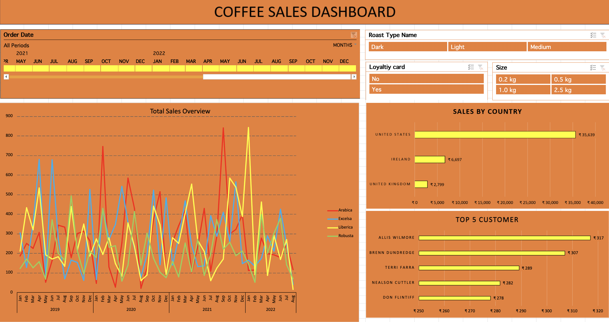
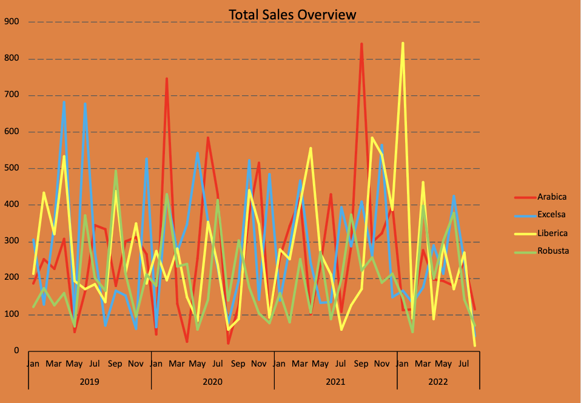
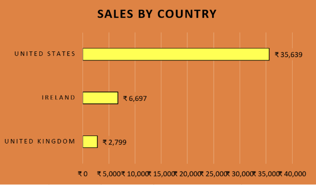
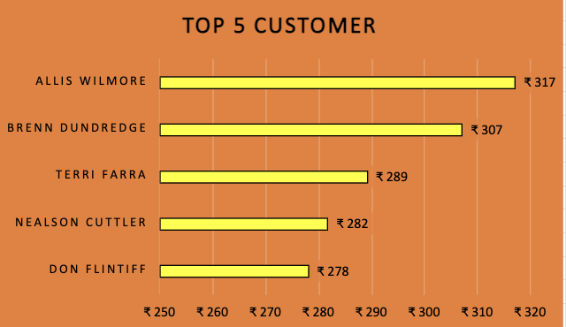
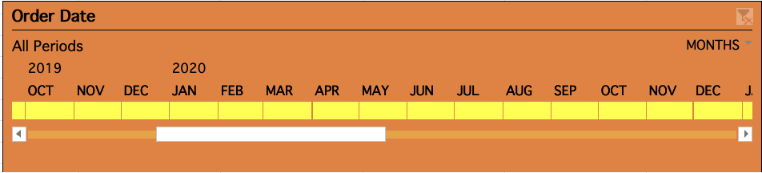
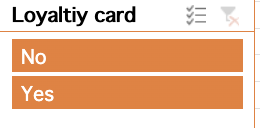
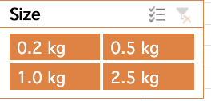

# Coffee Sales Dashboard using Excel

An interactive Excel dashboard to analyze coffee sales performance across time, product types, and customer segments.  
The dashboard is built entirely in Excel using tables, PivotTables, slicers, and charts.


---

## Overview

This project visualizes coffee shop sales data and allows users to:

- Track total sales over time
- Compare performance by country
- Identify top customers
- Slice and drill down into the data by product and customer attributes

All analysis and visuals are contained in a single Excel workbook.

---

## Key Features

### 1. Main Dashboard

The **Dashboard** sheet is the primary view and includes:

- **Total Sales Overview (Line Chart)**  
]
  - Monthly sales trend for each coffee type (Arabica, Excelsa, Liberica, Robusta).  
  - Helps compare performance between coffee types over time.

- **Sales by Country (Bar Chart)**  

  - Horizontal bar chart summarizing total revenue by country (e.g., United States, Ireland, United Kingdom).  
  - Quickly shows which country contributes most to total sales.

- **Top 5 Customers (Bar Chart)**  

  - Ranks the top 5 customers by total sales value.  
  - Useful for identifying key customers to focus on.

- **Interactive Filters (Slicers)**  
 !
[roastType](roastType.png)  
  - **Order Date** (May 2019 – Oct 2021)  
  - **Roast Type Name** (Dark, Light, Medium)  
  - **Loyalty Card** (Yes / No)  
  - **Size** (0.2 kg, 0.5 kg, 1.0 kg, 2.5 kg)  

These filters update all charts simultaneously, enabling dynamic exploration of the data.

---

## Workbook Structure

- **Dashboard**  
  Main interactive dashboard with charts and slicers.

- **Total Sales**  
  Supporting table or PivotTable used to calculate and summarize time-based sales.

- **country bar chart**  
  Data and calculations powering the country-level sales visualization.

- **Top 5 customer**  
  Data and logic to compute the top 5 customers by revenue.

- **orders**  
  Raw or cleaned order-level data (order date, product, quantity, price, etc.).

- **customers**  
  Customer dimension table (customer names, IDs, loyalty information, country, etc.).

- **products**  
  Product dimension table (coffee type, roast type, size, etc.).

You can customize or extend these sheets as needed for deeper analysis.

---

## How to Use

1. **Download the file**  
   - Clone this repository or download the `.xlsx` file directly.

2. **Open in Excel**  
   - Open the workbook in Microsoft Excel (desktop version recommended for best slicer and chart support).

3. **Explore the dashboard**  
   - Go to the **Dashboard** sheet.
   - Use the slicers at the top and right side to filter:
     - Time period
     - Roast type
     - Loyalty card status
     - Pack size
   - Observe how the line chart, country bar chart, and top 5 customers chart update.

4. **Inspect data tables**  
   - Navigate to `orders`, `customers`, and `products` sheets to see the underlying data structure.
   - Use these tables to add more PivotTables or build additional visuals.

---

## Requirements

- **Microsoft Excel** (recommended: Excel 2016 or later, or Microsoft 365)  
  Slicers and PivotCharts work best in the desktop version of Excel.

No external add-ins or macros are required.

---

## Possible Enhancements

Some ideas for future improvements:

- Add KPIs such as:
  - Average order value
  - Repeat vs new customers
  - Sales by loyalty status
- Add additional filters (e.g., city, channel, barista).
- Use conditional formatting on data tables for quick pattern detection.
- Add a separate “Summary” page with key metrics and insights in text form.
- Connect the workbook to a live data source (e.g., CSV exports, database, or Power Query).

---

## Learnings and Focus Areas

This project demonstrates:

- Building an interactive dashboard in Excel using:
  - Structured tables
  - PivotTables
  - PivotCharts
  - Slicers
- Translating raw order, customer, and product data into:
  - Clear visual stories
  - Business-friendly insights
- Applying a consistent design theme and layout to make the dashboard easy to read.

---

## Repository Contents

- `coffee-sales-dashboard.xlsx`  
  Main Excel file containing data, calculations, and the dashboard.

- `images/coffee-dashboard.png` (optional)  
  Screenshot of the dashboard for quick preview in the README.

---

## How to Run Locally

```bash
# 1. Clone the repository
git clone https://github.com/<your-username>/coffee-sales-dashboard.git

# 2. Open the Excel file
# Navigate to the folder and open `coffee-s
